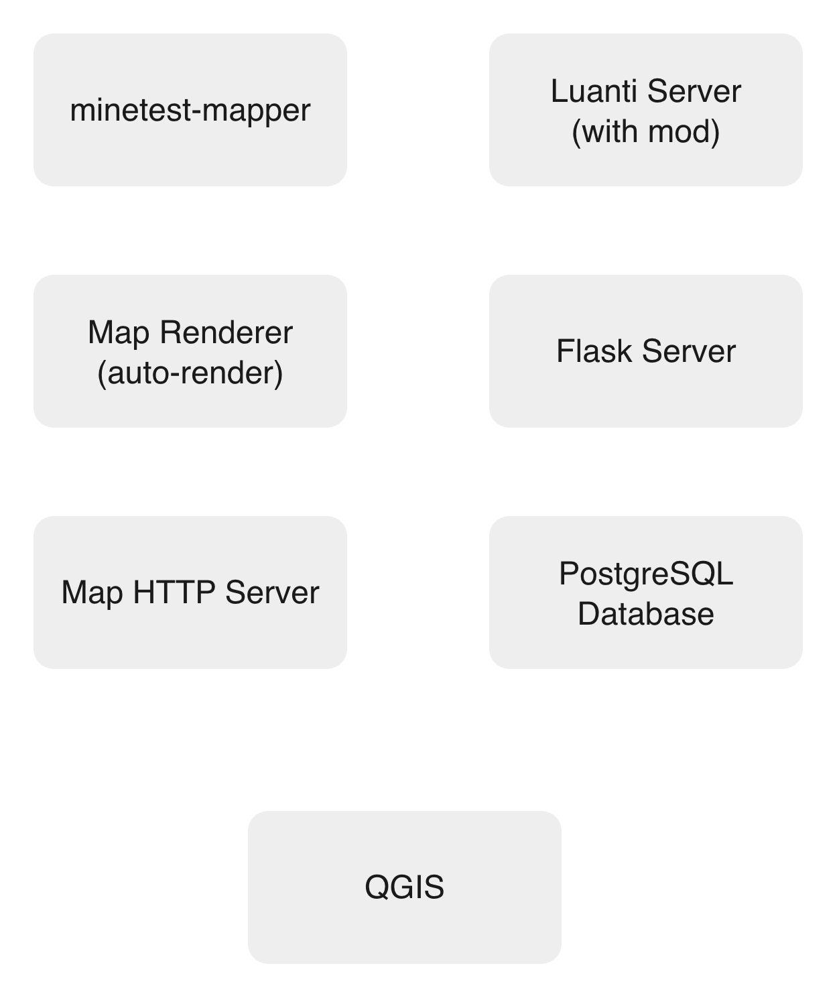

# Luanti/QGIS

Track player positions from a Luanti game server in real time, store them in PostgreSQL, and visualize them on a live map inside QGIS.



## What It Does

| Feature | Description |
|---|---|
| **Position Tracking** | Records every player's position once per second |
| **Live Map** | Auto-renders the game map every 15 seconds |
| **QGIS Integration** | View player traces as points on the map inside QGIS |
| **One-Command Deploy** | A single script installs everything |

## Requirements

- Ubuntu 20.04+ or Debian 11+
- 2 GB RAM (4 GB recommended)
- Root (sudo) access

## Install & Run

```bash
# 1. Become root
sudo bash

# 2. Download the project
cd /root
git clone https://github.com/Eph777/luanti-qgis.git
cd luanti-qgis

# 3. Deploy everything (installs database, server, renderer…)
./bin/deploy.sh            # interactive — asks before each step
./bin/deploy.sh --auto     # automatic  — no questions asked
```

Once deployment finishes, start the game server:

```bash
# Simple start (foreground, press Ctrl+C to stop)
~/start-luanti.sh myworld 30000

# With live map on port 8080
~/start-luanti.sh myworld 30000 --service --map 8080

# Interactive mode (guides you through options)
~/start-luanti.sh -i
```

Connect your Luanti client to `<your-server-ip>:30000`.

## View the Map in QGIS

1. **Add Raster Layer** — Layer → Add Layer → Add Raster Layer  
   Source: `http://<server-ip>:8080/map.png`

2. **Add PostGIS Layer** — Layer → Add Layer → Add PostGIS Layers  
   Connect to the PostgreSQL database (`luanti_db`, user `luanti`).  
   Select the view `view_live_positions` (or a world-specific one like `view_live_positions_myworld`).

## Project Structure

```
Position/
├── bin/deploy.sh               # One-command deployment
├── scripts/
│   ├── setup/                  # Database & renderer installers
│   ├── server/start-luanti.sh  # Game server launcher
│   └── map/                    # Map rendering & hosting
├── src/server.py               # Flask position tracker API
├── mod/                        # Luanti mod (sends positions)
├── schema.sql                  # Database tables
└── config/.env.example         # Configuration template
```

## Configuration

Copy and edit the environment file:

```bash
cp config/.env.example .env
nano .env
```

Key settings:

| Variable | Default | Purpose |
|---|---|---|
| `DB_PASS` | `postgres123` | **Change this in production** |
| `LUANTI_PORT` | `30000` | Game server UDP port |
| `MAP_SERVER_PORT` | `8080` | Map HTTP port |
| `MAP_RENDER_INTERVAL` | `15` | Seconds between map re-renders |

## Useful Commands

```bash
# Check everything is running
./bin/deploy.sh --status

# Update to latest version
./bin/deploy.sh --update

# Backup database
pg_dump -U luanti -d luanti_db > backup.sql

# Backup world
tar -czf world.tar.gz ~/snap/luanti/common/.minetest/worlds/myworld
```

## Documentation

- [DEPLOYMENT.md](DEPLOYMENT.md) — full production deployment guide
- [schema.sql](schema.sql) — database schema

## Contact

Ephraim BOURIAHI — amar-ephraim.bouriahi@etu.u-pec.fr  
GitHub: [https://github.com/Eph777/luanti-qgis](https://github.com/Eph777/luanti-qgis)
