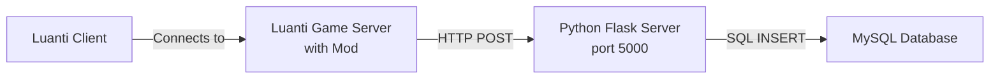

# Luanti Player Position Tracker - Server Setup Guide

This guide provides step-by-step instructions for deploying the Luanti Player Position Tracker on a remote server with MySQL database. This system tracks player positions from your Luanti game server and stores them in a MySQL database for analysis.

## Table of Contents

1. [System Overview](#system-overview)
2. [Prerequisites](#prerequisites)
3. [Server Setup](#server-setup)
4. [MySQL Installation and Configuration](#mysql-installation-and-configuration)
5. [Python Application Setup](#python-application-setup)
6. [Luanti Mod Installation](#luanti-mod-installation)
7. [Luanti Client Configuration](#luanti-client-configuration)
8. [Testing and Verification](#testing-and-verification)
9. [Troubleshooting](#troubleshooting)
10. [Security Considerations](#security-considerations)

---

## System Overview

The system consists of three components:



1. **Luanti Mod**: Runs on the game server, tracks player positions every second
2. **Python Flask Server**: Receives HTTP requests and stores data in MySQL
3. **MySQL Database**: Stores player position traces with timestamps

---

## Prerequisites

### Remote Server Requirements

- **Operating System**: Ubuntu 20.04+ (or similar Linux distribution)
- **RAM**: Minimum 1GB
- **Storage**: Minimum 10GB
- **Network**: Public IP address or domain name (for remote access)
- **Ports**: 
  - Port 5000 (Python Flask server)
  - Port 3306 (MySQL - can be restricted to localhost)
  - Port 30000 (Luanti game server - default)

### Local Requirements

- Luanti game client installed
- SSH access to your remote server
- Basic familiarity with terminal/command line

---

## Server Setup

### Step 1: Connect to Your Server

```bash
ssh your_username@your_server_ip
```

Replace `your_username` with your server username and `your_server_ip` with your server's IP address.

### Step 2: Update System Packages

```bash
sudo apt update
sudo apt upgrade -y
```

### Step 3: Install Required System Packages

```bash
sudo apt install -y python3 python3-pip python3-venv git mysql-server
```

---

## MySQL Installation and Configuration

### Step 1: Secure MySQL Installation

Run the MySQL security script:

```bash
sudo mysql_secure_installation
```

Follow the prompts:
- Set a strong root password
- Remove anonymous users: **Yes**
- Disallow root login remotely: **Yes** (recommended)
- Remove test database: **Yes**
- Reload privilege tables: **Yes**

### Step 2: Create Database and User

Login to MySQL as root:

```bash
sudo mysql -u root -p
```

Execute the following SQL commands:

```sql
-- Create the database
CREATE DATABASE luanti_db CHARACTER SET utf8mb4 COLLATE utf8mb4_unicode_ci;

-- Create a dedicated user for the application
CREATE USER 'luanti'@'localhost' IDENTIFIED BY 'luanti123';

-- Grant privileges
GRANT ALL PRIVILEGES ON luanti_db.* TO 'luanti'@'localhost';

-- Apply changes
FLUSH PRIVILEGES;

-- Verify the database was created
SHOW DATABASES;

-- Exit MySQL
EXIT;
```

> [!NOTE]
> For development, we're using the simple password `luanti123`. For production deployments, use a strong, unique password.

### Step 3: Import the Schema

Navigate to your project directory (we'll create this in the next section) and import the schema:

```bash
mysql -u luanti -p luanti_db < schema.sql
```

Enter the password (`luanti123`) when prompted.

---

## Python Application Setup

### Step 1: Clone or Upload Your Application

**Option A: Using Git (if your code is in a repository)**

```bash
cd ~
git clone your_repository_url Position
cd Position
```

**Option B: Manual Upload**

Upload your files using SCP from your local machine:

```bash
# Run this on your LOCAL machine
scp -r /Users/ephraim/Documents/Position your_username@your_server_ip:~/
```

Then on the server:

```bash
cd ~/Position
```

### Step 2: Create Python Virtual Environment

```bash
python3 -m venv venv
source venv/bin/activate
```

Your terminal prompt should now show `(venv)` at the beginning.

### Step 3: Install Python Dependencies

```bash
pip install --upgrade pip
pip install -r requirements.txt
```

### Step 4: Configure Environment Variables

Create your environment configuration file:

```bash
cp .env.example .env
nano .env
```

Update the values in `.env`:

```env
DB_HOST=localhost
DB_NAME=luanti_db
DB_USER=luanti
DB_PASS=luanti123
DB_PORT=3306
```

Save and exit (Ctrl+X, then Y, then Enter).

### Step 5: Import Database Schema

```bash
mysql -u luanti -p luanti_db < schema.sql
```

Enter the password when prompted.

### Step 6: Test the Flask Server

First, load the environment variables and start the server:

```bash
# Load environment variables
export $(cat .env | xargs)

# Start the Flask server
python3 server.py
```

You should see:

```
MySQL connection pool created successfully
 * Running on http://0.0.0.0:5000
```

Test the health check endpoint from another terminal window:

```bash
curl http://localhost:5000/
```

Expected response: `{"status":"running"}`

Press `Ctrl+C` to stop the server.

### Step 7: Run Flask Server as a Service

Create a systemd service file to keep the server running:

```bash
sudo nano /etc/systemd/system/luanti-tracker.service
```

Add the following content:

```ini
[Unit]
Description=Luanti Player Position Tracker
After=network.target mysql.service

[Service]
Type=simple
User=your_username
WorkingDirectory=/home/your_username/Position
Environment="PATH=/home/your_username/Position/venv/bin"
EnvironmentFile=/home/your_username/Position/.env
ExecStart=/home/your_username/Position/venv/bin/python3 /home/your_username/Position/server.py
Restart=always
RestartSec=10

[Install]
WantedBy=multi-user.target
```

> [!IMPORTANT]
> Replace `your_username` with your actual server username.

Save and exit. Then enable and start the service:

```bash
sudo systemctl daemon-reload
sudo systemctl enable luanti-tracker
sudo systemctl start luanti-tracker
```

Check the status:

```bash
sudo systemctl status luanti-tracker
```

You should see "active (running)" in green.

### Step 8: Configure Firewall

Allow traffic on port 5000:

```bash
sudo ufw allow 5000/tcp
sudo ufw allow 30000/udp  # For Luanti game server
sudo ufw enable
```

---

## Luanti Mod Installation

### Step 1: Locate Your Luanti Mods Folder

The Luanti server mods folder is typically located at:

- **Linux**: `~/.luanti/mods/` or `~/.minetest/mods/`
- **Windows**: `C:\Users\YourName\AppData\Roaming\Luanti\mods\` or `...\Minetest\mods\`
- **macOS**: `~/Library/Application Support/luanti/mods/` or `.../minetest/mods/`

### Step 2: Copy the Mod to Your Server

**If Luanti server is on the same machine:**

```bash
cp -r ~/Position/mod ~/.luanti/mods/position_tracker
```

**If Luanti server is on a different machine:**

From your local machine:

```bash
scp -r /Users/ephraim/Documents/Position/mod luanti_server_user@luanti_server_ip:~/.luanti/mods/position_tracker
```

### Step 3: Configure the Mod

Edit the mod's `init.lua` file to point to your Flask server:

```bash
nano ~/.luanti/mods/position_tracker/init.lua
```

Update the `SERVER_URL` at the top of the file:

```lua
local SERVER_URL = "http://your_server_ip:5000/position"
```

Replace `your_server_ip` with:
- `localhost` if Flask server is on the same machine as Luanti server
- Your server's public IP address if Flask server is on a different machine

Save and exit.

### Step 4: Enable HTTP for the Mod

Luanti restricts HTTP access for security. You need to whitelist this mod.

Edit the Luanti server configuration:

```bash
nano ~/.luanti/minetest.conf
```

Add or update the following line:

```ini
secure.http_mods = position_tracker
```

If the line already exists with other mods listed, add `position_tracker` to the comma-separated list:

```ini
secure.http_mods = existing_mod,another_mod,position_tracker
```

Save and exit.

### Step 5: Enable the Mod in World Settings

Start your Luanti server (or restart if already running). Then:

1. Open Luanti client
2. Go to the server/world configuration
3. Find "position_tracker" in the mods list
4. Enable it
5. Restart the server

Alternatively, edit the world's `world.mt` file directly:

```bash
nano ~/.luanti/worlds/your_world_name/world.mt
```

Add:

```
load_mod_position_tracker = true
```

---

## Luanti Client Configuration

### Step 1: Install Luanti Client

Download and install Luanti from: https://www.luanti.org/downloads/

### Step 2: Connect to Your Server

1. Launch Luanti
2. Click on "Join Game" or "Multiplayer"
3. Click "Add server" or enter directly:
   - **Address**: `your_server_ip` (or domain name)
   - **Port**: `30000` (default Luanti port, adjust if different)
   - **Name**: Any name you prefer
4. Click "Connect"

### Step 3: Join the Game

- Create a player account if prompted
- Join the game world
- Move around to generate position data

---

## Testing and Verification

### Step 1: Check Flask Server Logs

```bash
sudo journalctl -u luanti-tracker -f
```

You should see log entries like:

```
MySQL connection pool created successfully
 * Running on http://0.0.0.0:5000
```

When players move, you won't see individual position logs unless there's an error.

### Step 2: Verify Data in MySQL

Connect to MySQL:

```bash
mysql -u luanti -p luanti_db
```

Query the player traces:

```sql
-- Check if table exists
SHOW TABLES;

-- View recent traces
SELECT * FROM player_traces ORDER BY timestamp DESC LIMIT 10;

-- Count total traces
SELECT COUNT(*) FROM player_traces;

-- See traces by player
SELECT player_name, COUNT(*) as trace_count 
FROM player_traces 
GROUP BY player_name;

-- Exit
EXIT;
```

You should see position data with timestamps for connected players.

### Step 3: Test API Endpoint Manually

From your local machine or server:

```bash
curl -X POST http://your_server_ip:5000/position \
  -H "Content-Type: application/json" \
  -d '{"player":"test_player","pos":{"x":10.5,"y":20.0,"z":-5.3}}'
```

Expected response: `{"status":"success"}`

Then verify it was inserted:

```bash
mysql -u luanti -p luanti_db -e "SELECT * FROM player_traces WHERE player_name='test_player';"
```

---

## Troubleshooting

### Flask Server Won't Start

**Check service status:**

```bash
sudo systemctl status luanti-tracker
```

**View detailed logs:**

```bash
sudo journalctl -u luanti-tracker -n 50
```

**Common issues:**

1. **MySQL connection error**: Verify MySQL is running and credentials are correct
   ```bash
   sudo systemctl status mysql
   mysql -u luanti -p luanti_db
   ```

2. **Port already in use**: Check if port 5000 is available
   ```bash
   sudo netstat -tlnp | grep 5000
   ```

3. **Permission issues**: Ensure the service file has correct username and paths

### Luanti Mod Not Sending Data

**Check Luanti server logs:**

Look for errors related to `position_tracker`:

```bash
cat ~/.luanti/debug.txt | grep position_tracker
```

**Common issues:**

1. **HTTP not enabled**: Error message: `HTTP API not enabled`
   - Solution: Add `position_tracker` to `secure.http_mods` in `minetest.conf`

2. **Connection refused**: Mod can't reach Flask server
   - Verify Flask server is running: `curl http://localhost:5000/`
   - Check firewall: `sudo ufw status`
   - Verify SERVER_URL in `init.lua`

3. **Mod not enabled**: 
   - Check `world.mt` file
   - Restart Luanti server after enabling

### No Data in MySQL

**Verify database and table exist:**

```bash
mysql -u luanti -p -e "USE luanti_db; SHOW TABLES;"
```

If table doesn't exist, re-import schema:

```bash
mysql -u luanti -p luanti_db < schema.sql
```

**Check Flask server logs for database errors:**

```bash
sudo journalctl -u luanti-tracker -n 100 | grep -i error
```

### Connection Issues

**Test from Luanti server to Flask server:**

```bash
curl -X POST http://your_server_ip:5000/position \
  -H "Content-Type: application/json" \
  -d '{"player":"test","pos":{"x":1,"y":2,"z":3}}'
```

**Check firewall rules:**

```bash
sudo ufw status numbered
```

Ensure port 5000 is allowed.

---

## Security Considerations

### MySQL Security

> [!CAUTION]
> Never expose MySQL port 3306 to the internet unless absolutely necessary and properly secured.

1. **Keep MySQL on localhost**: Default configuration binds to `127.0.0.1`
   
   Verify:
   ```bash
   sudo netrc | grep mysql
   ```

2. **Use strong passwords**: For production deployments (development uses simple password)

3. **Limit privileges**: The `luanti` user only has access to `luanti_db`

4. **Regular backups**:
   ```bash
   mysqldump -u luanti -p luanti_db > backup_$(date +%Y%m%d).sql
   ```

### Flask Server Security

> [!WARNING]
> The current Flask configuration uses the development server. For production, consider using a production WSGI server like Gunicorn with Nginx.

1. **Use HTTPS**: Set up SSL/TLS certificates (Let's Encrypt)

2. **Restrict access**: 
   - Only allow connections from trusted IPs
   - Use firewall rules:
     ```bash
     sudo ufw allow from trusted_ip to any port 5000
     ```

3. **Environment variables**: Never commit `.env` file to version control

4. **Update regularly**: Keep all packages up to date
   ```bash
   pip list --outdated
   ```

### Luanti Server Security

1. **Change default port**: Edit `minetest.conf` to use a non-standard port

2. **Whitelist trusted mods**: Only add necessary mods to `secure.http_mods``

3. **Monitor logs**: Regularly check for suspicious activity

4. **Update Luanti**: Keep server and client updated to latest stable version

### Firewall Configuration

Minimal firewall setup:

```bash
sudo ufw default deny incoming
sudo ufw default allow outgoing
sudo ufw allow ssh
sudo ufw allow 5000/tcp    # Flask server
sudo ufw allow 30000/udp   # Luanti server
sudo ufw enable
```

---

## Advanced Configuration

### Auto-start on Boot

Both services are configured to start automatically:

```bash
# Check Flask server
sudo systemctl is-enabled luanti-tracker

# Check MySQL
sudo systemctl is-enabled mysql
```

### Monitoring and Logging

**Set up log rotation for Flask server:**

```bash
sudo nano /etc/logrotate.d/luanti-tracker
```

Add:

```
/var/log/luanti-tracker.log {
    daily
    rotate 7
    compress
    missingok
    notifempty
}
```

**Monitor server resources:**

```bash
# CPU and memory usage
top

# Disk usage
df -h

# MySQL processes
mysqladmin -u root -p processlist
```

### Database Optimization

For large datasets, consider:

1. **Archiving old data**:
   ```sql
   -- Create archive table
   CREATE TABLE player_traces_archive LIKE player_traces;
   
   -- Move old data
   INSERT INTO player_traces_archive 
   SELECT * FROM player_traces 
   WHERE timestamp < DATE_SUB(NOW(), INTERVAL 30 DAY);
   
   -- Delete archived data from main table
   DELETE FROM player_traces 
   WHERE timestamp < DATE_SUB(NOW(), INTERVAL 30 DAY);
   ```

2. **Add additional indexes** for common queries

3. **Partition tables** by date for better performance

---

## Summary

You now have a fully functional Luanti Player Position Tracker system with:

✅ MySQL database for persistent storage  
✅ Python Flask middleware for data processing  
✅ Luanti mod for position tracking  
✅ Systemd service for automatic startup  
✅ Security best practices implemented  

The system will automatically track and store player positions from your Luanti server. You can query the database at any time to analyze player movement patterns.

For questions or issues, review the [Troubleshooting](#troubleshooting) section or check the service logs.
