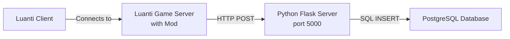

# Luanti Player Position Tracker - PostgreSQL Setup Guide

This guide provides step-by-step instructions for deploying the Luanti Player Position Tracker on a remote server with **PostgreSQL database**. This system tracks player positions from your Luanti game server and stores them in a PostgreSQL database for analysis.

> [!NOTE]
> This is the **PostgreSQL version** of the setup guide. If you prefer MySQL, see [SETUP_GUIDE.md](SETUP_GUIDE.md).

## Table of Contents

1. [System Overview](#system-overview)
2. [Prerequisites](#prerequisites)
3. [Server Setup](#server-setup)
4. [PostgreSQL Installation and Configuration](#postgresql-installation-and-configuration)
5. [Python Application Setup](#python-application-setup)
6. [Luanti Server Installation](#luanti-server-installation)
7. [Luanti Mod Installation](#luanti-mod-installation)
8. [Luanti Client Configuration](#luanti-client-configuration)
9. [Testing and Verification](#testing-and-verification)
10. [Troubleshooting](#troubleshooting)
11. [Security Considerations](#security-considerations)

---

## System Overview

The system consists of three components:



1. **Luanti Mod**: Runs on the game server, tracks player positions every second
2. **Python Flask Server**: Receives HTTP requests and stores data in PostgreSQL
3. **PostgreSQL Database**: Stores player position traces with timestamps

---

## Prerequisites

### Remote Server Requirements

- **Operating System**: Ubuntu 20.04+ (or similar Linux distribution)
- **RAM**: Minimum 1GB
- **Storage**: Minimum 10GB
- **Network**: Public IP address or domain name (for remote access)
- **Ports**: 
  - Port 5000 (Python Flask server)
  - Port 5432 (PostgreSQL - can be restricted to localhost)
  - Port 30000 (Luanti game server - default)

### Local Requirements

- Luanti game client installed
- SSH access to your remote server
- Basic familiarity with terminal/command line

---

## Server Setup

### Step 1: Connect to Your Server

```bash
ssh your_username@your_server_ip
```

Replace `your_username` with your server username and `your_server_ip` with your server's IP address.

### Step 2: Update System Packages

```bash
sudo apt update
sudo apt upgrade -y
```

### Step 3: Install Required System Packages

```bash
sudo apt install -y python3 python3-pip python3-venv git postgresql postgresql-contrib
```

---

## PostgreSQL Installation and Configuration

### Step 1: Verify PostgreSQL is Running

```bash
sudo systemctl status postgresql
```

You should see "active (running)" in green.

### Step 2: Create Database and User

Switch to the PostgreSQL user and access the PostgreSQL prompt:

```bash
sudo -u postgres psql
```

Execute the following SQL commands:

```sql
-- Create the database
CREATE DATABASE luanti_db;

-- Create a dedicated user for the application
CREATE USER luanti WITH PASSWORD 'postgres123';

-- Grant privileges
GRANT ALL PRIVILEGES ON DATABASE luanti_db TO luanti;

-- Connect to the database
\c luanti_db

-- Grant schema privileges (PostgreSQL 15+)
GRANT ALL ON SCHEMA public TO luanti;

-- Verify the database was created
\l

-- Exit PostgreSQL
\q
```

> [!NOTE]
> For development, we're using the simple password `postgres123`. For production deployments, use a strong, unique password.

### Step 3: Import the Schema

Navigate to your project directory (we'll create this in the next section) and import the schema:

```bash
psql -U luanti -d luanti_db -f schema_postgresql.sql
```

Enter the password (`postgres123`) when prompted.

---

## Python Application Setup

### Step 1: Clone or Upload Your Application

**Option A: Using Git (if your code is in a repository)**

```bash
cd ~
git clone your_repository_url Position
cd Position
```

**Option B: Manual Upload**

Upload your files using SCP from your local machine:

```bash
# Run this on your LOCAL machine
scp -r /Users/ephraim/Documents/Position your_username@your_server_ip:~/
```

Then on the server:

```bash
cd ~/Position
```

### Step 2: Create Python Virtual Environment

```bash
python3 -m venv venv
source venv/bin/activate
```

Your terminal prompt should now show `(venv)` at the beginning.

### Step 3: Install Python Dependencies

```bash
pip install --upgrade pip
pip install -r requirements_postgresql.txt
```

### Step 4: Configure Environment Variables

Create your environment configuration file:

```bash
cp .env.example.postgresql .env
nano .env
```

Update the values in `.env`:

```env
DB_HOST=localhost
DB_NAME=luanti_db
DB_USER=luanti
DB_PASS=postgres123
DB_PORT=5432
```

Save and exit (Ctrl+X, then Y, then Enter).

### Step 5: Import Database Schema

```bash
psql -U luanti -d luanti_db -f schema_postgresql.sql
```

Enter the password when prompted.

### Step 6: Test the Flask Server

First, load the environment variables and start the server:

```bash
# Load environment variables
export $(cat .env | xargs)

# Start the Flask server
python3 server_postgresql.py
```

You should see:

```
PostgreSQL connection pool created successfully
 * Running on http://0.0.0.0:5000
```

Test the health check endpoint from another terminal window:

```bash
curl http://localhost:5000/
```

Expected response: `{"status":"running"}`

Press `Ctrl+C` to stop the server.

### Step 7: Run Flask Server as a Service

Create a systemd service file to keep the server running:

```bash
sudo nano /etc/systemd/system/luanti-tracker-postgresql.service
```

Add the following content:

```ini
[Unit]
Description=Luanti Player Position Tracker (PostgreSQL)
After=network.target postgresql.service

[Service]
Type=simple
User=your_username
WorkingDirectory=/home/your_username/Position
Environment="PATH=/home/your_username/Position/venv/bin"
EnvironmentFile=/home/your_username/Position/.env
ExecStart=/home/your_username/Position/venv/bin/python3 /home/your_username/Position/server_postgresql.py
Restart=always
RestartSec=10

[Install]
WantedBy=multi-user.target
```

> [!IMPORTANT]
> Replace `your_username` with your actual server username.

Save and exit. Then enable and start the service:

```bash
sudo systemctl daemon-reload
sudo systemctl enable luanti-tracker-postgresql
sudo systemctl start luanti-tracker-postgresql
```

Check the status:

```bash
sudo systemctl status luanti-tracker-postgresql
```

You should see "active (running)" in green.

### Step 8: Configure Firewall

Allow traffic on port 5000:

```bash
sudo ufw allow 5000/tcp
sudo ufw allow 30000/udp  # For Luanti game server
sudo ufw enable
```

---

## Luanti Server Installation

### Step 6.1: Install Luanti Server

Luanti is best installed via Snap on Ubuntu:

```bash
sudo snap install luanti
```

### Step 6.2: Install Game Content (Minetest Game)

The engine needs game content to run. We'll install "Minetest Game".

**For Snap users (Recommended):**
The Snap version uses `.minetest` as the directory name.

```bash
# Create games directory
mkdir -p ~/snap/luanti/common/.minetest/games

# Download Minetest Game
git clone https://github.com/minetest/minetest_game.git ~/snap/luanti/common/.minetest/games/minetest_game
```

**For non-Snap users:**

```bash
mkdir -p ~/.luanti/games
git clone https://github.com/minetest/minetest_game.git ~/.luanti/games/minetest_game
```

### Step 6.3: Create a World

**For Snap users:**

```bash
mkdir -p ~/snap/luanti/common/.minetest/worlds/myworld
echo "gameid = minetest_game" > ~/snap/luanti/common/.minetest/worlds/myworld/world.mt
echo "backend = sqlite3" >> ~/snap/luanti/common/.minetest/worlds/myworld/world.mt
```

**For non-Snap users:**

```bash
mkdir -p ~/.luanti/worlds/myworld
echo "gameid = minetest_game" > ~/.luanti/worlds/myworld/world.mt
echo "backend = sqlite3" >> ~/.luanti/worlds/myworld/world.mt
```

---

## Luanti Mod Installation

### Step 1: Locate Your Luanti Mods Folder

The Luanti server mods folder is typically located at:

- **Linux (Snap)**: `~/snap/luanti/common/.minetest/mods/`
- **Linux (Apt)**: `~/.luanti/mods/`
- **Windows**: `.../AppData/Roaming/Luanti/mods/`

### Step 2: Copy the Mod to Your Server

**For Snap users:**
```bash
mkdir -p ~/snap/luanti/common/.minetest/mods
cp -r ~/Position/mod ~/snap/luanti/common/.minetest/mods/position_tracker
```

**For non-Snap users:**
```bash
mkdir -p ~/.luanti/mods
cp -r ~/Position/mod ~/.luanti/mods/position_tracker
```

### Step 3: Configure the Mod

**For Snap users:**
```bash
nano ~/snap/luanti/common/.minetest/mods/position_tracker/init.lua
```

**For non-Snap users:**
```bash
nano ~/.luanti/mods/position_tracker/init.lua
```

Update the `SERVER_URL`.

### Step 4: Enable HTTP for the Mod

**For Snap users:**
```bash
nano ~/snap/luanti/common/.minetest/minetest.conf
```

**For non-Snap users:**
```bash
nano ~/.luanti/minetest.conf
```

Add:
```ini
secure.http_mods = position_tracker
```

### Step 5: Enable Mod in World

**For Snap users:**
```bash
nano ~/snap/luanti/common/.minetest/worlds/myworld/world.mt
```

**For non-Snap users:**
```bash
nano ~/.luanti/worlds/myworld/world.mt
```

Add:
```
load_mod_position_tracker = true
```

---

## Luanti Client Configuration

### Step 1: Install Luanti Client

Download and install Luanti from: https://www.luanti.org/downloads/

### Step 2: Connect to Your Server

1. Launch Luanti
2. Click on "Join Game" or "Multiplayer"
3. Click "Add server" or enter directly:
   - **Address**: `your_server_ip` (or domain name)
   - **Port**: `30000` (default Luanti port, adjust if different)
   - **Name**: Any name you prefer
4. Click "Connect"

### Step 3: Join the Game

- Create a player account if prompted
- Join the game world
- Move around to generate position data

---

## Testing and Verification

### Step 1: Check Flask Server Logs

```bash
sudo journalctl -u luanti-tracker-postgresql -f
```

You should see log entries like:

```
PostgreSQL connection pool created successfully
 * Running on http://0.0.0.0:5000
```

### Step 2: Verify Data in PostgreSQL

Connect to PostgreSQL:

```bash
psql -U luanti -d luanti_db
```

Query the player traces:

```sql
-- Check if table exists
\dt

-- View recent traces
SELECT * FROM player_traces ORDER BY timestamp DESC LIMIT 10;

-- Count total traces
SELECT COUNT(*) FROM player_traces;

-- See traces by player
SELECT player_name, COUNT(*) as trace_count 
FROM player_traces 
GROUP BY player_name;

-- Exit
\q
```

You should see position data with timestamps for connected players.

### Step 3: Test API Endpoint Manually

From your local machine or server:

```bash
curl -X POST http://your_server_ip:5000/position \
  -H "Content-Type: application/json" \
  -d '{"player":"test_player","pos":{"x":10.5,"y":20.0,"z":-5.3}}'
```

Expected response: `{"status":"success"}`

Then verify it was inserted:

```bash
psql -U luanti -d luanti_db -c "SELECT * FROM player_traces WHERE player_name='test_player';"
```

---

## Troubleshooting

### Flask Server Won't Start

**Check service status:**

```bash
sudo systemctl status luanti-tracker-postgresql
```

**View detailed logs:**

```bash
sudo journalctl -u luanti-tracker-postgresql -n 50
```

**Common issues:**

1. **PostgreSQL connection error**: Verify PostgreSQL is running and credentials are correct
   ```bash
   sudo systemctl status postgresql
   psql -U luanti -d luanti_db
   ```

2. **Port already in use**: Check if port 5000 is available
   ```bash
   sudo netstat -tlnp | grep 5000
   ```

3. **Permission issues**: Ensure the service file has correct username and paths

4. **Authentication failed**: Check PostgreSQL `pg_hba.conf` for authentication method
   ```bash
   sudo nano /etc/postgresql/*/main/pg_hba.conf
   ```
   
   Ensure there's a line like:
   ```
   local   all             all                                     md5
   ```

### Luanti Mod Not Sending Data

**Check Luanti server logs:**

```bash
cat ~/.luanti/debug.txt | grep position_tracker
```

**Common issues:**

1. **HTTP not enabled**: Error message: `HTTP API not enabled`
   - Solution: Add `position_tracker` to `secure.http_mods` in `minetest.conf`

2. **Connection refused**: Mod can't reach Flask server
   - Verify Flask server is running: `curl http://localhost:5000/`
   - Check firewall: `sudo ufw status`
   - Verify SERVER_URL in `init.lua`

3. **Mod not enabled**: 
   - Check `world.mt` file
   - Restart Luanti server after enabling

### No Data in PostgreSQL

**Verify database and table exist:**

```bash
psql -U luanti -d luanti_db -c "\dt"
```

If table doesn't exist, re-import schema:

```bash
psql -U luanti -d luanti_db -f schema_postgresql.sql
```

**Check Flask server logs for database errors:**

```bash
sudo journalctl -u luanti-tracker-postgresql -n 100 | grep -i error
```

### Connection Issues

**Test from Luanti server to Flask server:**

```bash
curl -X POST http://your_server_ip:5000/position \
  -H "Content-Type: application/json" \
  -d '{"player":"test","pos":{"x":1,"y":2,"z":3}}'
```

**Check firewall rules:**

```bash
sudo ufw status numbered
```

Ensure port 5000 is allowed.

---

## Security Considerations

### PostgreSQL Security

> [!CAUTION]
> Never expose PostgreSQL port 5432 to the internet unless absolutely necessary and properly secured.

1. **Keep PostgreSQL on localhost**: Default configuration binds to `127.0.0.1`
   
   Verify in `/etc/postgresql/*/main/postgresql.conf`:
   ```bash
   sudo grep listen_addresses /etc/postgresql/*/main/postgresql.conf
   ```

2. **Use strong passwords**: For production deployments (development uses simple password)

3. **Limit privileges**: The `luanti` user only has access to `luanti_db`

4. **Regular backups**:
   ```bash
   pg_dump -U luanti luanti_db > backup_$(date +%Y%m%d).sql
   ```

5. **Configure authentication**: Edit `pg_hba.conf` to restrict access
   ```bash
   sudo nano /etc/postgresql/*/main/pg_hba.conf
   ```

### Flask Server Security

> [!WARNING]
> The current Flask configuration uses the development server. For production, consider using a production WSGI server like Gunicorn with Nginx.

1. **Use HTTPS**: Set up SSL/TLS certificates (Let's Encrypt)

2. **Restrict access**: 
   - Only allow connections from trusted IPs
   - Use firewall rules:
     ```bash
     sudo ufw allow from trusted_ip to any port 5000
     ```

3. **Environment variables**: Never commit `.env` file to version control

4. **Update regularly**: Keep all packages up to date
   ```bash
   pip list --outdated
   ```

### Luanti Server Security

1. **Change default port**: Edit `minetest.conf` to use a non-standard port

2. **Whitelist trusted mods**: Only add necessary mods to `secure.http_mods`

3. **Monitor logs**: Regularly check for suspicious activity

4. **Update Luanti**: Keep server and client updated to latest stable version

### Firewall Configuration

Minimal firewall setup:

```bash
sudo ufw default deny incoming
sudo ufw default allow outgoing
sudo ufw allow ssh
sudo ufw allow 5000/tcp    # Flask server
sudo ufw allow 30000/udp   # Luanti server
sudo ufw enable
```

---

## Advantages of PostgreSQL

### Why Choose PostgreSQL?

1. **Advanced Features**: 
   - Better support for complex queries
   - Native JSON/JSONB support
   - Advanced indexing options (GiST, GIN)

2. **Data Integrity**:
   - Strong ACID compliance
   - Robust transaction support
   - Better handling of concurrent connections

3. **Scalability**:
   - Excellent performance with large datasets
   - Better support for read replicas
   - Advanced partitioning capabilities

4. **Timezone Support**:
   - `TIMESTAMP WITH TIME ZONE` natively stores timezone information
   - Better for distributed systems across multiple timezones

### PostgreSQL vs MySQL for This Project

| Feature | PostgreSQL | MySQL |
|---------|-----------|-------|
| **Data Type** | TIMESTAMP WITH TIME ZONE | DATETIME (no timezone) |
| **Auto-increment** | SERIAL | AUTO_INCREMENT |
| **Default Port** | 5432 | 3306 |
| **Precision** | DOUBLE PRECISION | DOUBLE |
| **Timezone Handling** | Native | Manual conversion needed |

---

## Summary

You now have a fully functional Luanti Player Position Tracker system with:

✅ PostgreSQL database for persistent storage  
✅ Python Flask middleware for data processing  
✅ Luanti mod for position tracking  
✅ Systemd service for automatic startup  
✅ Security best practices implemented  
✅ Timezone-aware timestamp storage  

The system will automatically track and store player positions from your Luanti server. You can query the database at any time to analyze player movement patterns.

For questions or issues, review the [Troubleshooting](#troubleshooting) section or check the service logs.

---

## Additional Resources

- **PostgreSQL Documentation**: https://www.postgresql.org/docs/
- **psycopg2 Documentation**: https://www.psycopg.org/docs/
- **Luanti Official Site**: https://www.luanti.org/
- **Flask Documentation**: https://flask.palletsprojects.com/

For MySQL version, see [SETUP_GUIDE.md](SETUP_GUIDE.md).
